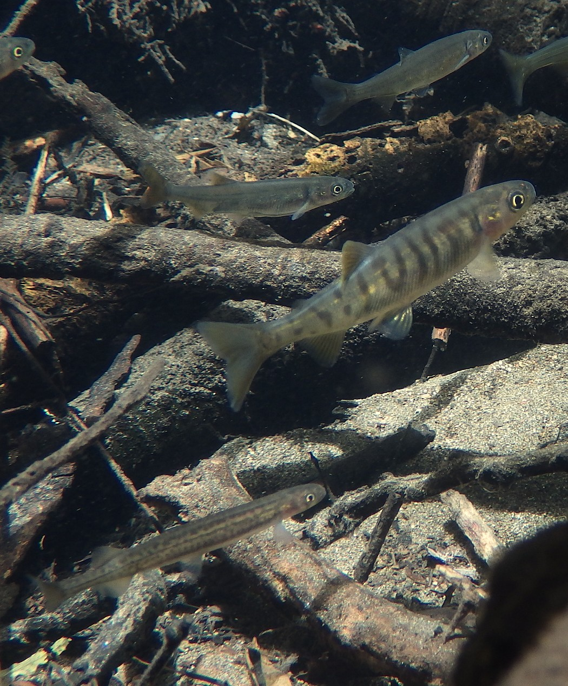
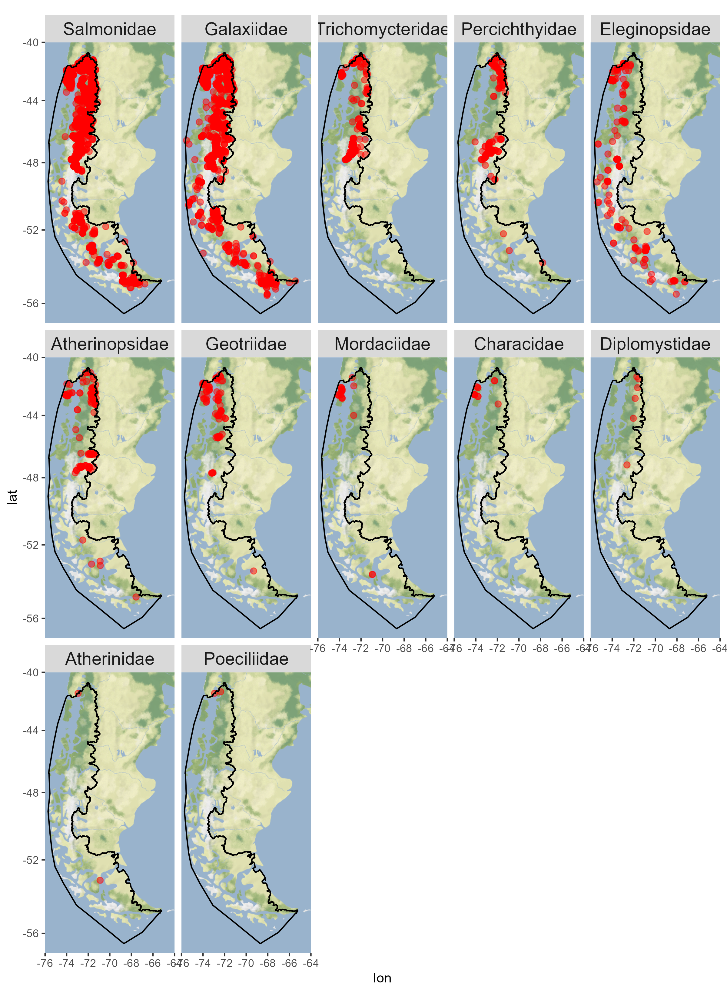

# Atlas ictiogeográfico de peces dulceacuícolas y diádromos de la Patagonia chilena / Ichthyogeographic atlas of freshwater and diadromous fishes of Chilean Patagonia



## Overview

This repository contains the working files, source datasets, processing utilities, and analytical outputs associated with the **Atlas Ictiogeográfico de la Patagonia Chilena**. The project compiles, harmonizes, curates, and documents occurrence records of freshwater, estuarine, and diadromous fishes from **western Chilean Patagonia**, broadly defined in the working report as the Pacific-draining basins south of the **Río Maullín**, including associated inland waters and inner seas, and a few Atlantic-draining basins with headwaters in Chile.

The repository is centered on the source document `Atlas_Ictiogeografico.Rmd`, which documents the rationale, data sources, harmonization steps, quality-control procedures, and preliminary outputs of the atlas workflow.

## Project purpose

The atlas was developed to:

- compile fish occurrence records from multiple heterogeneous sources;
- harmonize those records under the **Darwin Core (DwC)** standard;
- identify and correct structural, taxonomic, spatial, and temporal inconsistencies;
- reduce duplicated occurrences across overlapping datasets;
- produce a cleaner and more interoperable geographic database for biogeographic, ecological, and conservation uses.

## Current repository contents

At present, the repository includes the following main components:

### Core project files

- `Atlas_Ictiogeografico.Rmd` — main source document describing the atlas workflow
- `Atlas_Ictiogeografico.pdf` — current compiled PDF output

### Main directories

- `bibliography/` — bibliographic resources used by the report
- `data_sources/` — source-specific folders and source datasets, metadata, and preliminary steps
- `functions/` — helper R functions used in the workflow
- `input_parameters/` — supporting input tables and parameter files
- `outputs_global_analyses/` — curated outputs and derived products
- `table_joining/` — intermediate files and steps related to table integration [**HERE, keep?**]
- `tex/` — LaTeX-related resources for report generation

### Examples of current source-data folders

The `data_sources/` directory presently includes folders such as:

- `Addendum_MBoisjoly`
- `Darwin Initiative Fish Atlas`
- `Fish Database_CCorrea`
- `FishGIS_metaDatabase`
- `FishNet2`
- `GBIF`
- `GBIF_MMA`
- `Los_Peces_de_Argentina`
- `MAguilar_review`
- `SUBPESCA`
- `VertNet`
- `iDigBio`
- `iNaturalist`

### Examples of current output files

The `outputs_global_analyses/` directory currently contains products such as:

- `2025-12-17_AtlasIctio2025_Datos_DwC_deInteres_norepetidos_revisados.csv`
- `Output_all_standardized_taxa_list.csv`
- `Output_filtered_standardized_species_list.csv`
- `X.filtered.dedup_2025-12-02.csv`



These filenames may evolve as the project continues to be refined.

## Data standardization

A central aim of the project is to produce a fish occurrence database compatible with the **Darwin Core** standard. The working report explicitly documents the adoption and prioritization of DwC fields, as well as the harmonization of multiple original datasets into a common structure.

## Geographic and biological scope

### Geographic scope

The working report defines the study area as Pacific-draining basins south of the **Río Maullín**, extending from the Puerto Montt area southward, including Chilean Patagonia and, where relevant to Chilean basins, transboundary basin context.

### Biological scope

The atlas focuses on fish species that at some point during theur life cycle consistently utilize freshwater or estuarine habitats:

- freshwater fishes;
- estuarine fishes;
- diadromous fishes.

## Workflow summary

In broad terms, the workflow documented in this repository includes:

1. identification and gathering of relevant occurrence datasets;
2. inspection of original structures and metadata;
3. mapping and homologation of fields to Darwin Core;
4. correction of formatting and content inconsistencies;
5. taxonomic and geographic review;
6. duplicate detection and reduction;
7. generation of consolidated outputs and preliminary summaries.

## Funding and institutional context

This compilation was prepared in the context of the **Programa Austral Patagonia (ProAP)**, with participation from the **Universidad Austral de Chile** and support from **The Pew Charitable Trusts**.

## Repository structure

```text
chilean-patagonia-freshwater-and-diadromous-fish-atlas/
├── README.md
├── LICENSE
├── Atlas_Ictio_project.Rproj
├── Atlas_Ictiogeografico.Rmd
├── Atlas_Ictiogeografico.pdf
├── bibliography/
├── data_sources/
├── functions/
├── input_parameters/
├── outputs_global_analyses/
├── table_joining/
├── tex/
└── images/
    ├── photo1.jpg
    └── map_figure.png
```

## License

This repository is intended to be shared under:

**Creative Commons Attribution-NonCommercial 4.0 International (CC BY-NC 4.0)**

## Citation

A formal citation will be added once the atlas, report, or associated dataset is finalized, versioned and published as a data paper. For now, a provisional citation is as follows:

*Spanish*
Correa, Cristian y Maryse Boisjoly (2026) Atlas ictiogeográfico de peces dulceacuícolas y diádromos de la Patagonia chilena. <https://github.com/ojoaustral/chilean-patagonia-freshwater-and-diadromous-fish-atlas>

*English*
Correa, Cristian and Maryse Boisjoly (2026) Ichthyogeographic atlas of freshwater and diadromous fishes of Chilean Patagonia. <https://github.com/ojoaustral/chilean-patagonia-freshwater-and-diadromous-fish-atlas>
